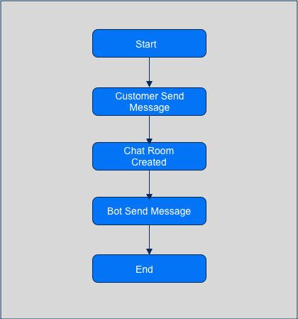

# Send Message

## Flow



## Send Message

Send Text Message to customer within window session.

```bash
curl --request POST \
  --url https://chat-service.qontak.com/api/open/v1/messages/whatsapp/bot \
  --header 'Authorization: Bearer ${ACCESS_TOKEN}' \
  --header 'Content-Type: application/json'
  --data-raw '{
    "room_id": "<uuid_room>",
    "type": "text",
    "text": "<String>"
  }'
```

Response

```json
{
  "status": "success",
  "data": {
    "id": "06beff5b-972f-4122-a9e2-80fc72b2c3e6",
    "type": "text",
    "room_id": "2f213fb3-a87c-4b48-9f01-051382f58155",
    "is_campaign": false,
    "sender_id": "2fcf11ac-5d78-475a-9000-fea426e3c270",
    "sender_type": "Models::SystemAccount",
    "sender": {
      "name": "Bot",
      "avatar": null
    },
    "participant_id": "01878b1c-fc59-4072-b045-7ddf79269948",
    "organization_id": "5c8521e5-5978-4817-9ceb-ae1710d676c9",
    "text": "Bot Send Message",
    "status": "created",
    "participant_type": "bot",
    "external_id": null,
    "local_id": null,
    "created_at": "2021-03-04T02:51:27.324Z",
    "reply": null,
    "room": {
      "id": "2f213fb3-a87c-4b48-9f01-051382f58155",
      "name": "Burhanudin",
      "description": "",
      "status": "unassigned",
      "type": "Models::CustomerServiceRoom",
      "tags": [],
      "channel": "wa",
      "channel_account": "Qontak",
      "organization_id": "5c8521e5-5978-4817-9ceb-ae1710d676c9",
      "account_uniq_id": "628117661000",
      "channel_integration_id": "b3a2ee0b-7dac-47b8-a115-7bc63abf8f15",
      "session": "open",
      "session_at": "2021-03-04T02:49:26.000Z",
      "unread_count": 2,
      "created_at": "2021-03-04T02:50:11.694Z",
      "updated_at": "2021-03-04T02:50:11.694Z",
      "avatar": null,
      "resolved_at": null,
      "external_id": null,
      "resolved_by_id": null,
      "resolved_by_type": null
    }
  }
}
```