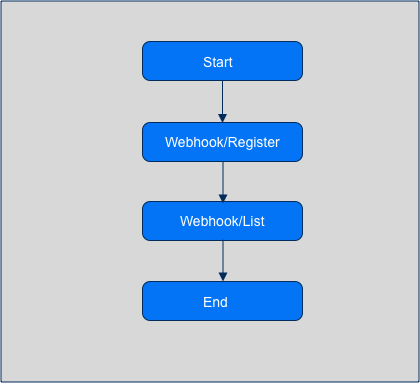

# Webhook

Who Can Use This Feature |
--------- |
`Bot User Token`  |
 

In Webhook API there is two endpoints that is to register webhook notification and list all registered webhook url.

# Flow

Webhook Notifications :
- Message Interactions : Incoming Message from Agent and Customer; Outbound Message Status.
- Room Interactions : Room Resolved Webhook;

Endpoint's Url

1. [Webhook/Register](../Webhook-API/Message-Interaction.md)
2. [Webhook/List](../Webhook-API/Message-Interaction.md#response)